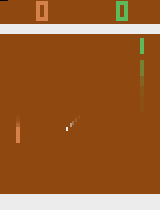

# gymutils
Tools for OpenAI gym.


## Installation
```
git clone https://github.com/walkingmask/gymutils.git
cd gymutils && pip install -e .
```


## Requirements
- numpy
- opencv-python
- Pillow
- scikit-image


## Usage
### Look and save multiple observations
```
import gym
from gymutils.observation.concat import concat_horizontally
from gymutils.observation.view import look, save

env = gym.make('Pong-v0')
_ = env.reset()

obs1, _, _, _ = env.step(0)
obs2, _, _, _ = env.step(2)
obs3, _, _, _ = env.step(3)

observation = concat_horizontally([obs1, obs2, obs3], margin_height=5)
look(observation)
save(observation, './images/', 'result1')
```


### Attach text label to observation
```
from gymutils.observation.concat import concat_vertically
from gymutils.text_array import TextArrayGenerator3D

generator = TextArrayGenerator3D(canvas_size=(20, 160), font_size=2)

text_none = generator.generate(['None'])
text_up = generator.generate(['Up'])
text_down = generator.generate(['Down'])

obs_none = concat_vertically([obs1, text_none])
obs_up = concat_vertically([obs2, text_up])
obs_down = concat_vertically([obs3, text_down])

observation = concat_horizontally([obs_none, obs_up, obs_down], margin_width=3)
save(observation, './images/', 'result2')
```


### Record observations as video
```
from gymutils.observation.view import Recorder

recorder = Recorder(size=(230, 160), path='./images', out='result3')

done, _ = False, env.reset()
while not done:
    observation, _, done, _ = obs.step(2)
    text = generator.generate(["{:0.5f}".format(observation.mean())])
    observation = concat_vertically([observation, text])
    recorder.record(observation)

recorder.stop()
```

~~[result3](./images/result3.mov)~~

### Draw ball trajectory
```
from gymutils.observation import TrajectoryDrawer

_ = env.reset()
for _ in range(20): _ = env.step(0)

drawer = TrajectoryDrawer()

for _ in range(5):
    obs, _, _, _ = env.step(2)
    drawing = drawer.draw(obs)

save(drawing, './images', 'result4')
```




## API
```
gymutils
├── observation
│   ├── look(observation)
│   ├── TrajectoryDrawer(env_name='Pong', alpha=0.5)
│   │   ├── get_env_name()
│   │   └── draw(observation)
│   ├── Recorder(fps=15, size=(210, 160), path='.', out='out')
│   │   ├── record(observations, cvt_color=True)
│   │   └── stop()
│   ├── save(observations, path, name, prefix='', suffix='', ext='png')
│   ├── concat
│   │   ├── concat_horizontally(observations, margin_width=0)
│   │   └── concat_vertically(observations, margin_height=0)
│   ├── draw
│   │   └── TrajectoryDrawer
│   └── view
│       ├── look
│       ├── Recorder
│       └── save
└── text_array
    └── TextArrayGenerator3D(canvas_size=None, font_size=1)
        ├── reset(canvas_size=None, font_size=1)
        └── generate(list_of_str)
```
